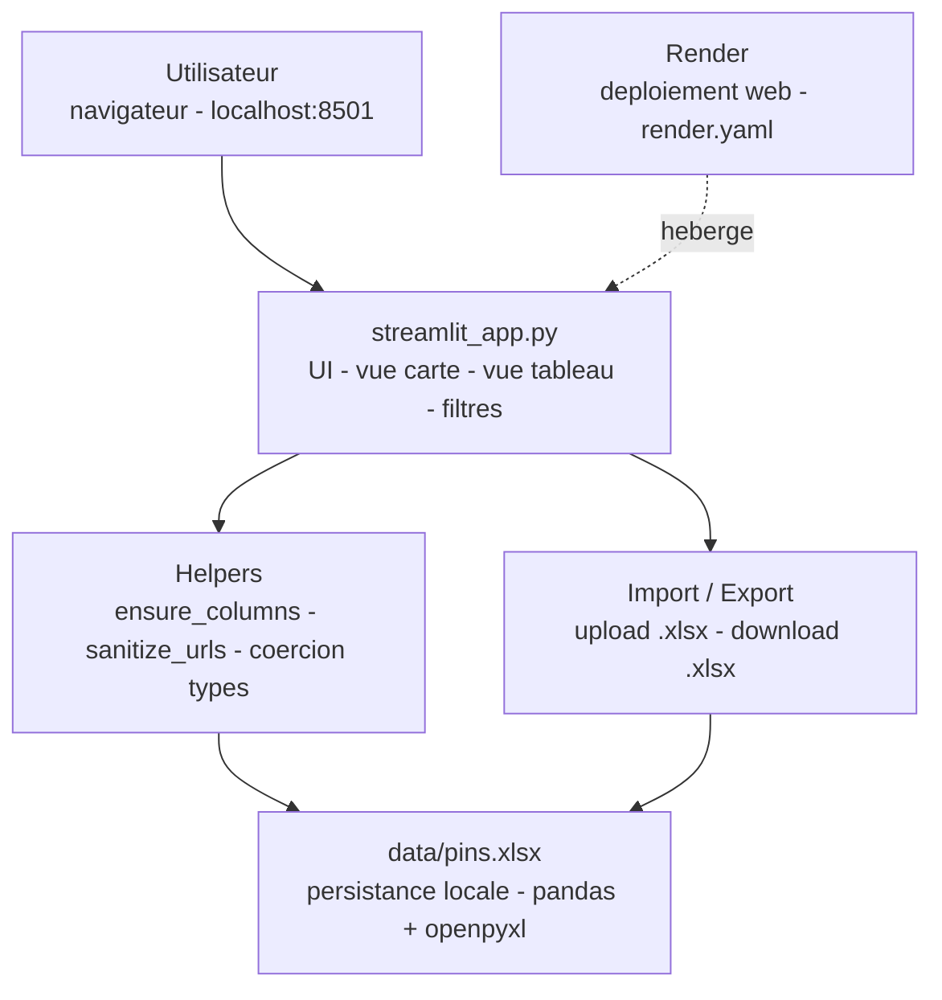

# Pin Collector

<!-- adam-badges:start -->
[](https://github.com/Adam-Blf/pin-collector/commits) [](https://hits.sh/github.com/Adam-Blf/pin-collector/) [](https://github.com/Adam-Blf/pin-collector/commits) [](https://github.com/Adam-Blf/pin-collector) [](LICENSE)
<!-- adam-badges:end -->


Gestionnaire de collections de pins (Streamlit) - catalogage, filtrage, import/export Excel, vues carte et tableau.

## Architecture



---

[](https://www.linkedin.com/in/adambeloucif/) 


  

### Construit avec les outils et technologies : 

              

🇫🇷 Français | 🇬🇧 Anglais | 🇪🇸 Espagnol | 🇮🇹 Italien | 🇵🇹 Portugais | 🇷🇺 Russe | 🇩🇪 Allemand | 🇹🇷 Turc

# Pin Collector / Collecteur de Pins

[🇫🇷 Version Française](#version-française) | [🇬🇧 English Version](#english-version)

---

## <a name="version-française"></a>🇫🇷 Version Française

Application web alimentée par **Streamlit** pour gérer et organiser vos collections de pins. Importez/exportez des fichiers Excel, modifiez les entrées en temps réel avec des vues carte ou tableau, et maintenez votre collection localement en toute simplicité.

### ✨ Fonctionnalités

- 🎴 **Vues Carte & Tableau** : basculez entre la disposition visuelle en cartes et les tableaux de données éditables
- 📊 **Import/Export Excel** : gestion transparente des fichiers .xlsx avec alignement automatique des colonnes
- 🔍 **Filtres Puissants** : recherche par texte, série, collection ou statut d'échange
- 💾 **Persistance Locale** : sauvegardez vos données dans `data/pins.xlsx` pour une utilisation hors ligne
- 🖼️ **Support d'Images** : affichez les images de pins via URL (HTTP/HTTPS)
- ✏️ **Édition en Ligne** : modifiez les entrées directement dans la vue carte avec options sauvegarder/annuler
- 🎯 **Validation Intelligente** : nettoyage automatique des URL et application des types de données

### 🛠️ Stack Technologique

| Composant | Technologie | Objectif |
|-----------|------------|----------|
| **Framework** | Streamlit 1.37+ | Interface web interactive |
| **Traitement de Données** | pandas 2.2+ | Opérations DataFrame, E/S Excel |
| **Moteur Excel** | openpyxl 3.1+ | Lecture/écriture fichiers .xlsx |
| **Langage** | Python 3.9+ | Logique applicative principale |

### 📁 Structure du Projet

```
pin-collector/
├── streamlit_app.py          # Application Streamlit principale
├── requirements.txt           # Dépendances Python
├── .env.example               # Modèle de configuration d'environnement
├── data/
│   ├── pins.xlsx              # Base de données locale des pins (créée automatiquement)
│   └── sample_pins.xlsx       # Jeu de données exemple
├── scripts/                   # Scripts de lancement multi-plateformes
│   ├── index.html             # Interface de lancement visuelle
│   ├── start_windows.bat      # Lanceur batch Windows
│   ├── setup_and_run.ps1      # Configuration automatisée PowerShell
│   └── start_unix.sh          # Lanceur macOS/Linux
└── README.md
```

### 🚀 Démarrage Rapide

#### Prérequis
- Python 3.9 ou supérieur
- Gestionnaire de paquets pip

#### Installation

```bash
# Clonez ou téléchargez le dépôt
cd pin-collector

# Créez un environnement virtuel (recommandé)
python -m venv .venv

# Activez l'environnement
# Windows PowerShell:
.\.venv\Scripts\Activate.ps1
# Windows CMD:
.venv\Scripts\activate.bat
# macOS/Linux:
source .venv/bin/activate

# Installez les dépendances
pip install -r requirements.txt

# Lancez l'application
streamlit run streamlit_app.py
```

L'application s'ouvrira automatiquement dans votre navigateur par défaut à l'adresse `http://localhost:8501`.

#### Alternative : Lanceur Visuel

Ouvrez `scripts/index.html` dans un navigateur pour une configuration guidée avec commandes copier-coller et scripts spécifiques à la plateforme :
- **Windows** : `scripts/start_windows.bat` ou `scripts/setup_and_run.ps1`
- **macOS/Linux** : `scripts/start_unix.sh`

### 📋 Schéma de Données

#### Colonnes Par Défaut

| Colonne | Type | Description | Exemple |
|---------|------|-------------|---------|
| `name` | Texte | Identifiant du pin | "Pikachu #001" |
| `serie` | Texte | Nom de la série | "Kanto" |
| `collection` | Texte | Groupe de collection | "Starter Pack" |
| `quantity` | Entier | Nombre possédé | 3 |
| `state` | Texte | État | "Neuf", "Bon", "Usé" |
| `tradeable` | Booléen | Disponible pour échange | true/false |
| `price` | Décimal | Valeur en € | 9.99 |
| `tags` | Texte | Mots-clés séparés par virgules | "rare, limité" |
| `notes` | Texte | Informations supplémentaires | "Cadeau de 2024" |
| `image_url` | URL | Lien image (HTTP/HTTPS) | "https://..." |

#### Comportement de l'Import Excel

- **Colonnes manquantes** : ajoutées automatiquement avec valeurs par défaut
- **Colonnes supplémentaires** : préservées dans le jeu de données
- **Conversion de types** : quantity → int, price → float, tradeable → bool
- **Validation d'URL** : les URL non-HTTP/HTTPS sont effacées

Modèle Excel exemple : `data/sample_pins.xlsx`

### 🎯 Guide d'Utilisation

#### Ajouter de Nouveaux Pins

1. Développez la section **"Nouveau pin"**
2. Remplissez les détails (minimum : nom)
3. Cliquez sur **"Ajouter"** pour ajouter à la collection

#### Importer des Données

- **Barre latérale** : Utilisez le téléverseur **"Importer un Excel"**
- **Ou** : Cliquez sur **"Charger data/pins.xlsx si dispo"** pour charger le fichier local
- Les colonnes sont alignées automatiquement ; aucun pré-traitement de schéma nécessaire

#### Filtrer

- **Recherche texte** : correspond au contenu de n'importe quel champ (insensible à la casse)
- **Série/Collection** : correspondance partielle de chaîne
- **Statut d'échange** : afficher uniquement les pins échangeables/non-échangeables

#### Modifier les Entrées

**Vue Carte :**
1. Cliquez sur **"Editer"** sur n'importe quelle carte
2. Modifiez les champs dans le formulaire en ligne
3. **"Enregistrer"** pour sauvegarder ou **"Annuler"** pour abandonner

**Vue Tableau :**
- Activez **"Mode tableau editable"** dans la barre latérale
- Modifiez les cellules directement dans l'éditeur de données
- Les modifications s'appliquent immédiatement

#### Exporter & Sauvegarder

- **Export Excel** : Spécifiez le nom de fichier → **"Exporter Excel"** → bouton de téléchargement
- **Sauvegarder Localement** : **"Enregistrer dans data/pins.xlsx"** écrit sur le disque

### ⚙️ Configuration

Copiez `.env.example` vers `.env` et personnalisez :

```env
# Chemin du répertoire de données
DATA_DIR=data

# Nom de fichier Excel par défaut
DEFAULT_EXCEL=pins.xlsx

# Taille maximale de téléversement (MB)
MAX_UPLOAD_SIZE_MB=200

# Mode débogage
DEBUG=false
```

> **Note** : La configuration Streamlit (port, thème, etc.) est gérée via `.streamlit/config.toml`. Voir [docs Streamlit](https://docs.streamlit.io/library/advanced-features/configuration) pour plus de détails.

### 🔒 Bonnes Pratiques de Sécurité

- **Validation d'URL** : Seules les URL d'images `http://` et `https://` sont acceptées
- **Limites de Téléversement** : 200MB par défaut ; ajustez `MAX_UPLOAD_SIZE_MB` selon les besoins
- **Mode Local Uniquement** : Pas de base de données externe ; toutes les données restent sur votre machine
- **Nettoyage des Entrées** : Les champs texte sont automatiquement nettoyés et tronqués
- **Sécurité de Type** : Quantité/prix convertis en types numériques avec gestion d'erreurs

#### Confidentialité des Données

- Pin Collector fonctionne **entièrement en local** sans appels API externes
- Les fichiers Excel ne quittent jamais votre appareil sauf si explicitement exportés
- Les URL d'images sont chargées côté client par votre navigateur (considérez les implications de confidentialité si vous utilisez des images sensibles)

### 🧪 Tests

Créez un jeu de données de test :

```python
import pandas as pd

test_data = pd.DataFrame([
    {"name": "Test Pin 1", "serie": "Alpha", "quantity": 5},
    {"name": "Test Pin 2", "serie": "Beta", "quantity": 2, "tradeable": True}
])
test_data.to_excel("test_import.xlsx", index=False)
```

Lancez l'application et téléversez `test_import.xlsx` pour vérifier le comportement d'import.

### 🗺️ Feuille de Route

- [ ] **Vignettes d'Images** : Générer des aperçus locaux pour utilisation hors ligne
- [ ] **Export CSV** : Ajouter un format d'export alternatif
- [ ] **Gestion Multi-Collections** : Collections séparées avec onglets
- [ ] **Recherche Avancée** : Modèles regex, plages de dates, filtres de prix
- [ ] **Thématisation** : Schémas de couleurs personnalisés et mode sombre
- [ ] **Sauvegarde/Restauration** : Instantanés automatisés avec historique de versions
- [ ] **Tableau de Bord Statistiques** : Valeur de collection, métriques de complétion
- [ ] **Optimisation Mobile** : Dispositions de cartes responsives pour petits écrans

---

## <a name="english-version"></a>🇬🇧 English Version

A **Streamlit**-powered web application for managing and organizing pin collections. Import/export Excel files, edit entries in real-time with card or table views, and maintain your collection locally with ease.

### ✨ Features

- 🎴 **Card & Table Views**: switch between visual card layout and editable data tables
- 📊 **Excel Import/Export**: seamless .xlsx file handling with automatic column alignment
- 🔍 **Powerful Filters**: search by text, series, collection, or trade status
- 💾 **Local Persistence**: save your data to `data/pins.xlsx` for offline use
- 🖼️ **Image Support**: display pin images via URL (HTTP/HTTPS)
- ✏️ **Inline Editing**: modify entries directly in card view with save/cancel options
- 🎯 **Smart Validation**: automatic URL sanitization and data type enforcement

### 🛠️ Tech Stack

| Component | Technology | Purpose |
|-----------|------------|---------|
| **Framework** | Streamlit 1.37+ | Interactive web UI |
| **Data Processing** | pandas 2.2+ | DataFrame operations, Excel I/O |
| **Excel Engine** | openpyxl 3.1+ | .xlsx file read/write |
| **Language** | Python 3.9+ | Core application logic |

### 📁 Project Structure

```
pin-collector/
├── streamlit_app.py          # Main Streamlit application
├── requirements.txt           # Python dependencies
├── .env.example               # Environment configuration template
├── data/
│   ├── pins.xlsx              # Local pin database (auto-created)
│   └── sample_pins.xlsx       # Example dataset
├── scripts/                   # Cross-platform launch scripts
│   ├── index.html             # Visual launcher interface
│   ├── start_windows.bat      # Windows batch launcher
│   ├── setup_and_run.ps1      # PowerShell automated setup
│   └── start_unix.sh          # macOS/Linux launcher
└── README.md
```

### 🚀 Quick Start

#### Prerequisites
- Python 3.9 or higher
- pip package manager

#### Installation

```bash
# Clone or download the repository
cd pin-collector

# Create virtual environment (recommended)
python -m venv .venv

# Activate environment
# Windows PowerShell:
.\.venv\Scripts\Activate.ps1
# Windows CMD:
.venv\Scripts\activate.bat
# macOS/Linux:
source .venv/bin/activate

# Install dependencies
pip install -r requirements.txt

# Launch the application
streamlit run streamlit_app.py
```

The app will open automatically in your default browser at `http://localhost:8501`.

#### Alternative: Visual Launcher

Open `scripts/index.html` in a browser for a guided setup with copy-paste commands and platform-specific scripts:
- **Windows**: `scripts/start_windows.bat` or `scripts/setup_and_run.ps1`
- **macOS/Linux**: `scripts/start_unix.sh`

### 📋 Data Schema

#### Default Columns

| Column | Type | Description | Example |
|--------|------|-------------|---------|
| `name` | Text | Pin identifier | "Pikachu #001" |
| `serie` | Text | Series name | "Kanto" |
| `collection` | Text | Collection group | "Starter Pack" |
| `quantity` | Integer | Number owned | 3 |
| `state` | Text | Condition | "Neuf", "Bon", "Usé" |
| `tradeable` | Boolean | Available for trade | true/false |
| `price` | Float | Value in € | 9.99 |
| `tags` | Text | Comma-separated keywords | "rare, limited" |
| `notes` | Text | Additional info | "Gift from 2024" |
| `image_url` | URL | Image link (HTTP/HTTPS) | "https://..." |

#### Excel Import Behavior

- **Missing columns**: automatically added with default values
- **Extra columns**: preserved in the dataset
- **Type coercion**: quantity → int, price → float, tradeable → bool
- **URL validation**: non-HTTP/HTTPS URLs are cleared

Example Excel template: `data/sample_pins.xlsx`

### 🎯 Usage Guide

#### Adding New Pins

1. Expand the **"Nouveau pin"** section
2. Fill in details (minimum: name)
3. Click **"Ajouter"** to append to collection

#### Importing Data

- **Sidebar**: Use **"Importer un Excel"** file uploader
- **Or**: Click **"Charger data/pins.xlsx si dispo"** to load local file
- Columns are aligned automatically; no schema pre-processing needed

#### Filtering

- **Text search**: matches any field content (case-insensitive)
- **Series/Collection**: partial string match
- **Trade status**: show only tradeable/non-tradeable pins

#### Editing Entries

**Card View:**
1. Click **"Editer"** on any card
2. Modify fields in the inline form
3. **"Enregistrer"** to save or **"Annuler"** to discard

**Table View:**
- Toggle **"Mode tableau editable"** in sidebar
- Edit cells directly in the data editor
- Changes apply immediately

#### Exporting & Saving

- **Export Excel**: Specify filename → **"Exporter Excel"** → download button
- **Save Locally**: **"Enregistrer dans data/pins.xlsx"** writes to disk

### ⚙️ Configuration

Copy `.env.example` to `.env` and customize:

```env
# Data directory path
DATA_DIR=data

# Default Excel filename
DEFAULT_EXCEL=pins.xlsx

# Maximum upload size (MB)
MAX_UPLOAD_SIZE_MB=200

# Debug mode
DEBUG=false
```

> **Note**: Streamlit configuration (port, theme, etc.) is managed via `.streamlit/config.toml`. See [Streamlit docs](https://docs.streamlit.io/library/advanced-features/configuration) for details.

### 🔒 Security Best Practices

- **URL Validation**: Only `http://` and `https://` image URLs are accepted
- **File Upload Limits**: Default 200MB; adjust `MAX_UPLOAD_SIZE_MB` as needed
- **Local-Only Mode**: No external database; all data stays on your machine
- **Input Sanitization**: Text fields are stripped and trimmed automatically
- **Type Safety**: Quantity/price coerced to numeric types with error handling

#### Data Privacy

- Pin Collector runs **entirely locally** with no external API calls
- Excel files never leave your device unless explicitly exported
- Image URLs are loaded client-side by your browser (consider privacy implications if using sensitive images)

### 🧪 Testing

Create a test dataset:

```python
import pandas as pd

test_data = pd.DataFrame([
    {"name": "Test Pin 1", "serie": "Alpha", "quantity": 5},
    {"name": "Test Pin 2", "serie": "Beta", "quantity": 2, "tradeable": True}
])
test_data.to_excel("test_import.xlsx", index=False)
```

Launch the app and upload `test_import.xlsx` to verify import behavior.

### 🗺️ Roadmap

- [ ] **Image Thumbnails**: Generate local previews for offline use
- [ ] **CSV Export**: Add alternative export format
- [ ] **Multi-Collection Management**: Separate collections with tabs
- [ ] **Advanced Search**: Regex patterns, date ranges, price filters
- [ ] **Theming**: Custom color schemes and dark mode
- [ ] **Backup/Restore**: Automated snapshots with version history
- [ ] **Statistics Dashboard**: Collection value, completion metrics
- [ ] **Mobile Optimization**: Responsive card layouts for smaller screens

### 📄 License

This project is licensed under the **MIT License**. See [LICENSE](LICENSE) for details.

---

**Developed with ❤️ for pin collectors everywhere**

For issues or feature requests, open an issue on [GitHub](https://github.com/Adam-Blf/pin-collector).

---

<p align="center">
  <sub>Par <a href="https://adam.beloucif.com">Adam Beloucif</a> - Data Engineer & Fullstack Developer - <a href="https://github.com/Adam-Blf">GitHub</a> - <a href="https://www.linkedin.com/in/adambeloucif/">LinkedIn</a></sub>
</p>


## Star History

<a href="https://www.star-history.com/?repos=Adam-Blf%2Fpin-collector&type=date&legend=top-left">
 <picture>
   <source media="(prefers-color-scheme: dark)" srcset="https://api.star-history.com/chart?repos=Adam-Blf/pin-collector&type=date&theme=dark&legend=top-left" />
   <source media="(prefers-color-scheme: light)" srcset="https://api.star-history.com/chart?repos=Adam-Blf/pin-collector&type=date&legend=top-left" />
   
 </picture>
</a>
